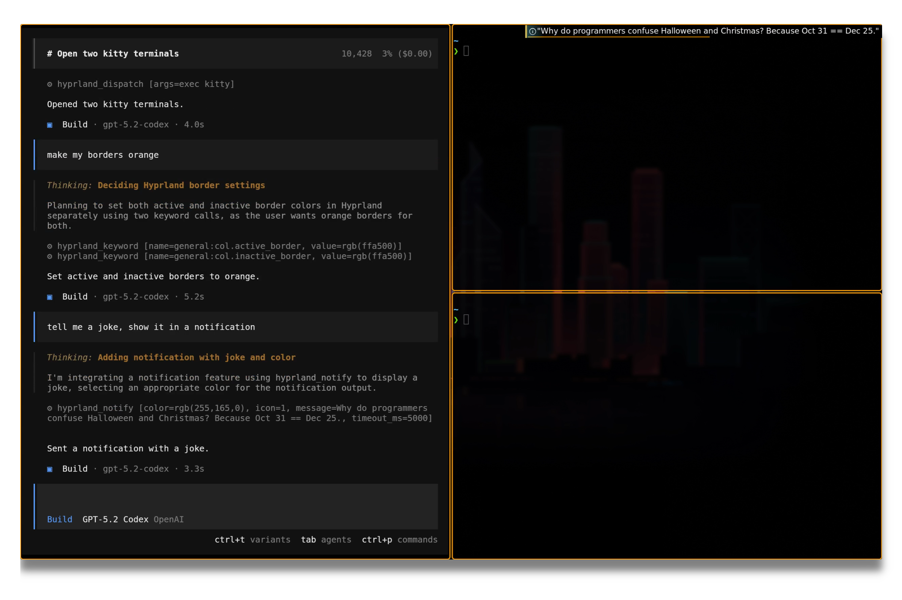

# Hyprland MCP

`hyprland-mcp` is a local MCP server that exposes Hyprland controls as tools.

It connects to Hyprland's unix socket (`.socket.sock`) and lets MCP clients run
common compositor actions (workspace switching, querying windows/monitors,
notifications, dispatch commands, etc.) through a structured tool interface.



## Installation

Install from crates.io:

```bash
cargo install hyprland-mcp
```

Or from this repository:

```bash
cargo install --path .
```

